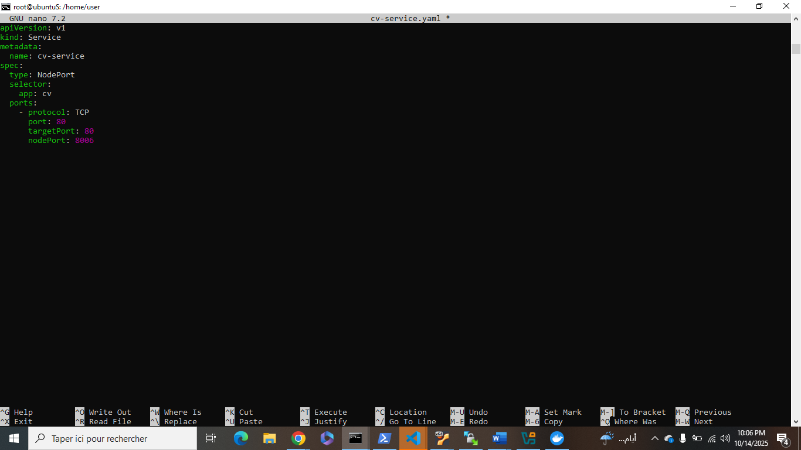

# CV One Page - Yathreb Difallah

## But
Publier un CV one-page en HTML/CSS via GitHub Pages, conteneuriser l'app et la déployer localement avec Docker Compose, puis déployer sur K3S.
## Arborescence
- index.html
- Dockerfile
- docker-compose.yml
- README.md
- captures

## Étapes principales
# Partie 1 — CV, Git, Docker, Docker Hub, docker-compose
1. `git init` → `git commit -m "Version 1"`
2. Création du repo GitHub: `mariemm.github.io`
3. `git push origin main` & `git push origin dev`
4. Build Docker image: `docker build -t yathrebdifallah233/cv:v1 .`
5. Push to Docker Hub: `docker push yathrebdifallah233/cv:v1`
6. docker-compose: `docker compose up -d` (port 8005)
# Partie 2 — K3s (Controller + 2 workers) et déploiement
7. K3S: installer  `curl -sfL https://get.k3s.io | sh -`
8. Récupération du token pour les workers `sudo cat /var/lib/rancher/k3s/server/node-token`
9. Installation de K3s sur les workers `curl -sfL https://get.k3s.io | K3S_URL=https://IP_controller:6443 K3S_TOKEN=<token_du_master> sh -`
8. Accès au cluster depuis la machine physique (Windows)`sudo cat /etc/rancher/k3s/k3s.yaml``scp /etc/rancher/k3s/k3s.yaml user@host:/home/user/.kube/config` 
9. Création des manifests Kubernetes cv-deployment.yaml et cv-service.yaml:`kubectl apply -f cv-deployment.yaml kubectl apply -f cv-service.yaml`
10. Test d’accès: `http://<IP_du_master>:nodePort`
## Captures d'écran

